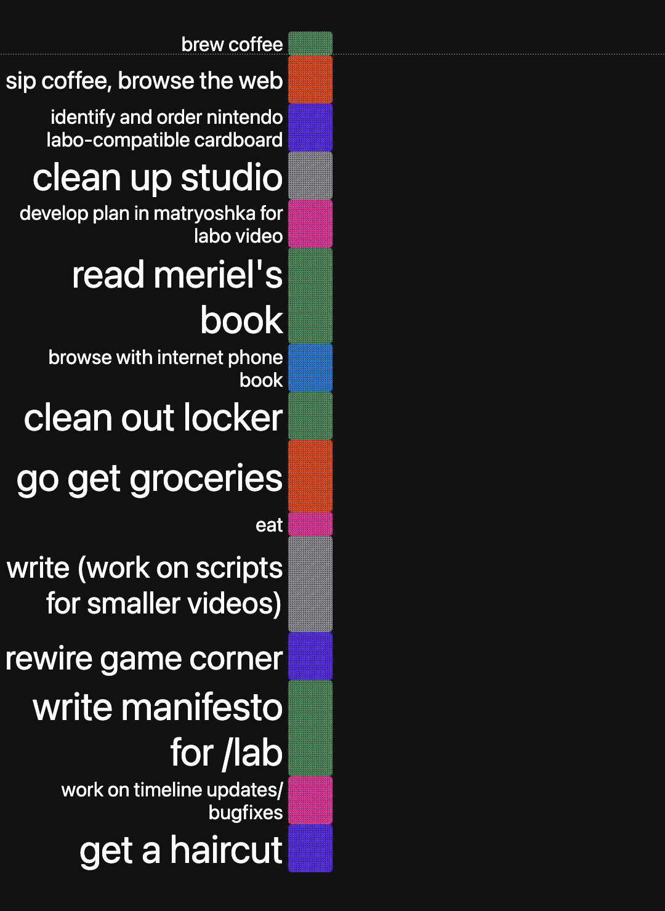
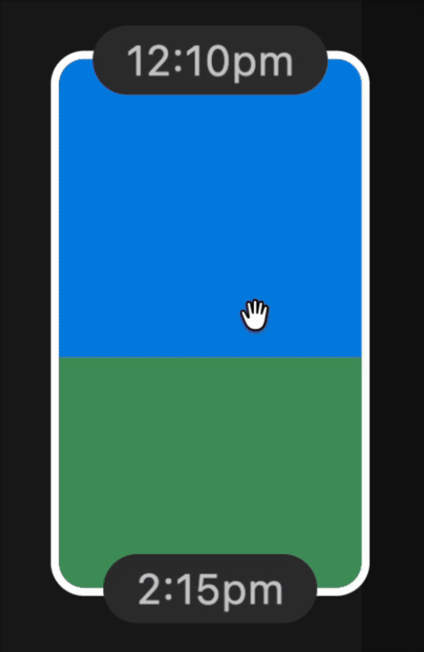

# timeline 🎐

	
	  
	<a href="https://hunterirving.github.io/timeline">live demo ↗</a>

 

## tomorrow's the big day
at night, use the `left column` to plan the day ahead.

once you wake up, use the `right column` to keep a record of how things go.

when your day is over, you can use the two columns to reflect on what you accomplished.

## usage
- click anywhere within the central pillar to add a new "chunk"
	- while a chunk is active (white border), type to update its description
	- click and drag chunks to reposition them within their columns
	- use the resize handles along the top/bottom edges of each chunk to adjust their durations
	- scroll up or down while hovering a chunk to change its color
	

	
	

- a dotted line will move from the top of the screen to the bottom. this is the "now line". 
- a chime will play whenever a new left column chunk is starting. this is usually a good time to update the right column with recent happenings and settle in for your next task.
- press `⌘ + m` to export the day's accomplishments as the text body of an email message.

## license
<a href="license">GPLv3</a>